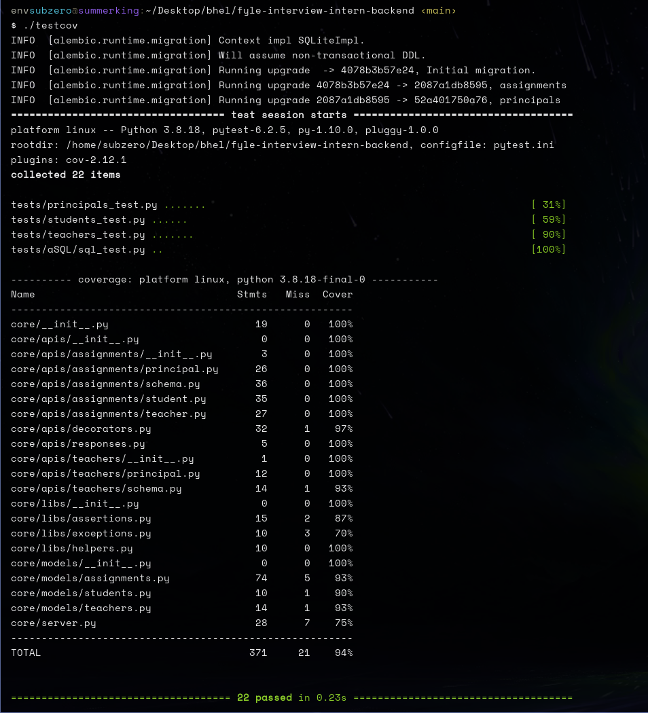

# Fyle Backend Challenge



I have edited the test for the `test_get_assignments_in_various_states`, the expected value did not align with the actual state of the database, due to previous tests, changing the state of the db.
I have also renamed the SQL/ folder to aSQL/ because I wanted to **ensure that the SQL tests are run before any changes are made to the db by the other tests**

### Install requirements

```
virtualenv env --python=python3.8
source env/bin/activate
pip install -r requirements.txt
```

### Start Server

```
bash run.sh
```

### Run Tests

> NOTE: I recommend using the following commands to view test results and coverage, the commands run basic scripts that creates a fresh db before testing it ensuring that the expected results and the database state is in sync. Without this the sql test for testing the various states of assignemnts WILL FAIL. 

```
# for tests
bash test

# for coverage
bash testcov
```


